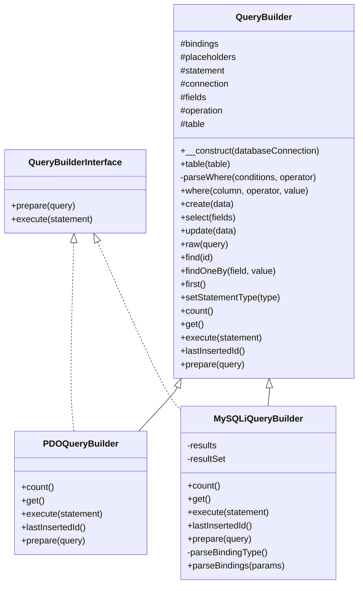
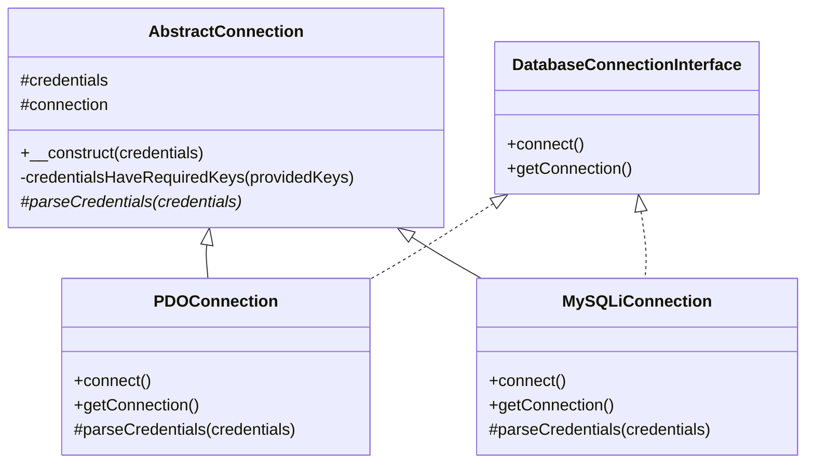

# Bug tracking app

This is a simple PHP 7.3 application to improve TDD skills.

## Installation

```bash
composer install
```

## Execute tests

You can execute all the test with the next command:

```bash
vendor/bin/phpunit Tests --testdox
````

Or execute only one test file:

```bash
vendor/bin/phpunit Tests --testdox --filter <test file name>
```

## UML Class Diagram




