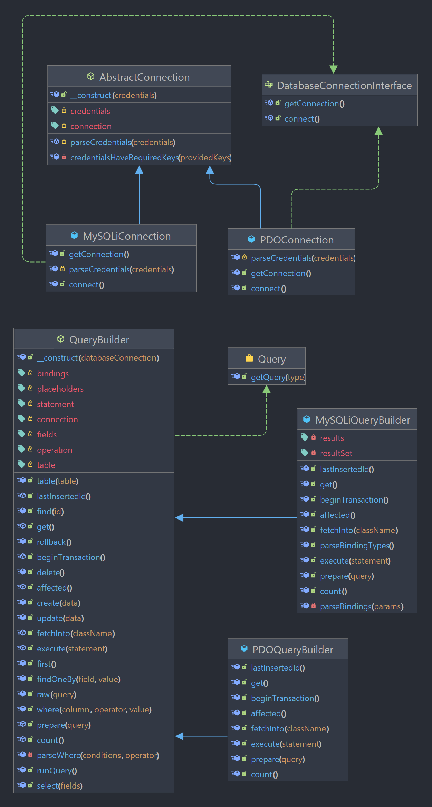

# Bug tracking app

This is a web application to track bug reports, allows us to manage the reports, create new ones, updated and deleted if
it's necessary.

## Features

- CRUD operations for bug reports
- Custom logger to track the status of the application
- Custom exception handler to manage the exceptions
- Functionality to save the logs in a file
- Unit tests for the main classes
- Functional tests for the CRUD operations

## Technologies

- PHP 7.3
- PHP Unit 9.0
- Docker
- Docker Compose
- MySQL 8.0

## What I learned?

- How to create a custom logger to track the status of the application
- How to create a custom exception handler to manage the exceptions
- How to save the logs in a file
- How to create unit and functional tests
- How to apply the TDD methodology
- How create an application using the Repository Pattern

## UML Class Diagram



## Setup

After clone the repository, you need to create a `.env` file in the root of the project with the same variables of
the `.env.example` file, if the review of the application it's just for demonstration purposes, you can use the
`.env.example` file just renaming it, or you can use the next command to make a copy with the same content.

```bash
cp .env.example .env
```

Then you need to install the dependencies with the next command:

```bash
composer install
```

## Usage

### Prerequisites

With the purpose of make the execution of the application easier, I created a `docker-compose.yml` file to create the
instance of the database, if you want to use your own instance of MySQL, you can do it, just need to execute the content
of the `sql/init_test` file to create the databases and tables that the application needs.

If you want to use [Docker](https://www.docker.com/) and [Docker Compose](https://docs.docker.com/compose/) to create
the instance of the database, you need to execute the next command:

```bash
docker-compose up -d
```

This will to create a container with the instance of MySQL 8.0, and the database will be created automatically. In order
to avoid problems with this approach you need to get free the port 3306 of your machine, because this is the port that
the container uses.

Also, I included a `docker-compose.prod.yml` file to simulate an environment of production, this file uses the same
credentials of the `.env` file, but you can change it if you want. To execute this container you need to execute the
next command:

```bash
docker-compose -f docker-compose.prod.yml up -d
```

### Run the application

To run the application you need to execute the next command:

```bash
php -S localhost:3000
```

This will to create a server in the port 3000, when you visit the URL `http://localhost:3000` you will see the home page
of the app:


## Tests

To execute the tests you need to follow the [usage prerequisites](#prerequisites), because the tests use the same
instance of the
database.

You can execute all the test with the next command:

```bash
vendor/bin/phpunit Tests --testdox
```

Or execute only one test file:

```bash
vendor/bin/phpunit Tests --testdox --filter <test file name>
```

After execute the first test command on your terminal you'll se an output like this:


## Author

- [Ángel Cruz](https://angelcruzl.dev)

## License

This project is open source and available under the [MIT License](https://choosealicense.com/licenses/mit/).
